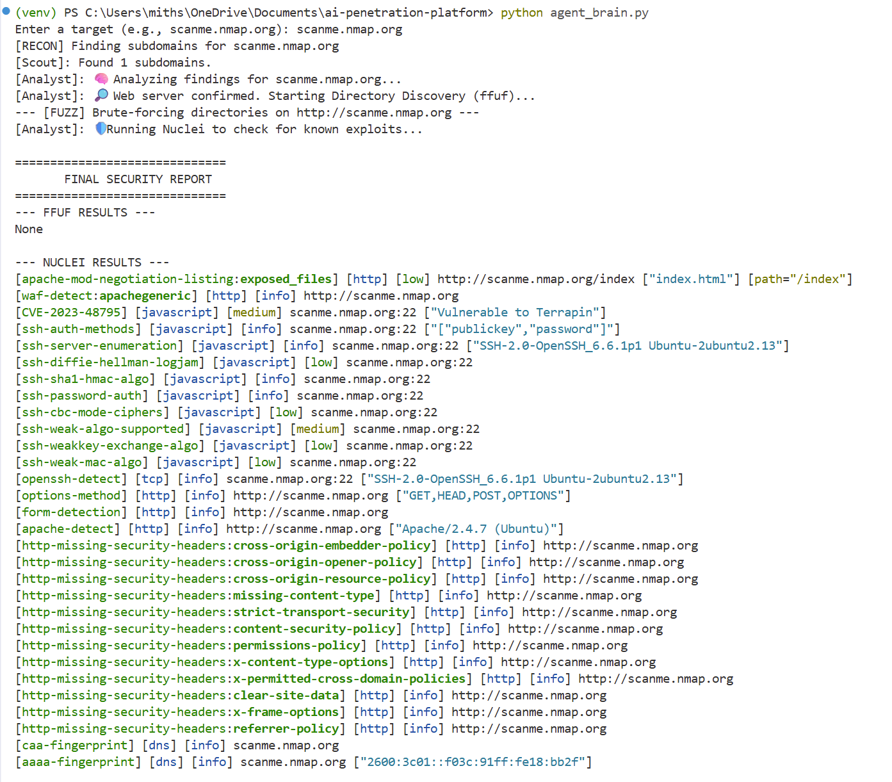
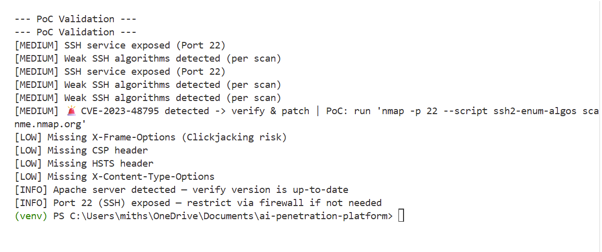

# AI Penetration Platform

An AI-assisted penetration testing toolkit that combines:

- An MCP server that exposes recon and vulnerability tools
- A lightweight agent loop driven by an LLM
- A LangGraph workflow that chains reconnaissance and analysis

This project is designed for security research and automation on systems you are authorized to test.

## Features

- MCP tools exposed through `FastMCP`
- Recon scanning with Nmap and Subfinder
- Web assessment with Nuclei, ffuf, and header probing
- SQL injection probing with sqlmap
- Two orchestration modes:
	- Interactive LLM loop (`mcp_server.py agent`)
	- LangGraph multi-step workflow (`agent_brain.py`)

## Report



## Project Structure

- `mcp_server.py`: MCP server, tool wrappers, and interactive LLM agent loop
- `agent_brain.py`: LangGraph workflow (`scout -> analyst`) using real tools
- `.env`: environment variables (contains `OPENAI_API_KEY`)

## Prerequisites

### Python

- Python 3.10+

### CLI Security Tools (must be installed and available in PATH)

- `nmap`
- `nuclei`
- `subfinder`
- `sqlmap`
- `ffuf`
- `curl`

On Windows, make sure each executable can be run from PowerShell directly.

## Python Dependencies

Install required packages in your virtual environment:

```powershell
pip install fastmcp openai python-dotenv langgraph
```

## Environment Variables

Create a `.env` file in the project root:

```env
OPENAI_API_KEY=your_openai_api_key_here
```

## Quick Start

### 1) Activate virtual environment

```powershell
venv\Scripts\Activate.ps1
```

### 2) Run the MCP server

```powershell
python mcp_server.py
```

### 3) Run the interactive agent loop

```powershell
python mcp_server.py agent
```

### 4) Run the LangGraph workflow

```powershell
python agent_brain.py
```

## How It Works

### MCP Server (`mcp_server.py`)

Registers tool functions via `@mcp.tool()` and executes external binaries with controlled subprocess calls and timeouts.

Exposed tools:

- `run_nmap(target)`
- `run_nuclei(target_url)`
- `manual_probe_headers(url)`
- `run_subfinder(domain)`
- `run_sqlmap(url)`
- `run_ffuf(target_url, wordlist_path="common.txt")`

### Interactive Agent Mode (`python mcp_server.py agent`)

1. Prompts for a target
2. Calls the LLM with a constrained action format
3. Parses `THOUGHT`, `ACTION`, `INPUT`
4. Executes the selected tool
5. Feeds output back for up to 3 steps

### LangGraph Workflow (`agent_brain.py`)

- `scout`: runs subdomain enumeration + Nmap recon
- `analyst`: branches based on recon signatures:
	- database indicators -> sqlmap
	- web indicators -> ffuf then nuclei
	- fallback -> nuclei

## Example Usage

### Interactive Agent

```text
python mcp_server.py agent
Enter target (example.com): scanme.nmap.org
```

### LangGraph Flow

```text
python agent_brain.py
Enter a target (e.g., scanme.nmap.org): example.com
```

## Next Steps

### 1) PoC Validation and Sandboxing

### 2) Infrastructure and Dashboard

### 3) Compliance and Governance

### 4) Social Engineering Module (Controlled)

## Notes and Limitations

- Tool availability is external; missing binaries will cause runtime errors.
- Output formatting is raw subprocess output and may require post-processing.
- Decision logic in `agent_brain.py` is heuristic and based on string matching.
- `run_ffuf` defaults to `common.txt`; provide a valid wordlist file path when needed.

## Security and Legal Use

Use this project only on assets you own or have explicit written permission to test. Unauthorized scanning or exploitation attempts may be illegal.

## Troubleshooting

- `command not found` or equivalent:
	- Verify the tool is installed and in PATH.
- OpenAI authentication errors:
	- Confirm `.env` exists and `OPENAI_API_KEY` is valid.
- Empty scan output:
	- Re-check target format and network reachability.

## License

See `LICENSE`.